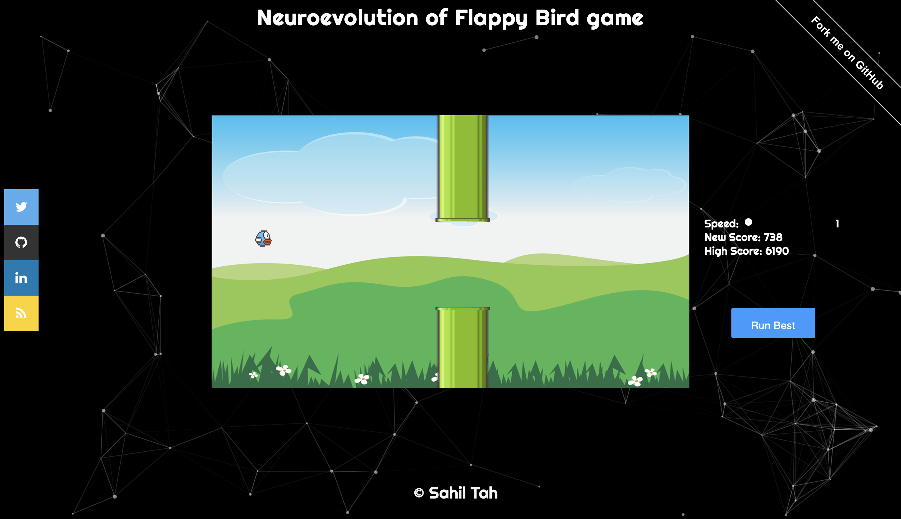
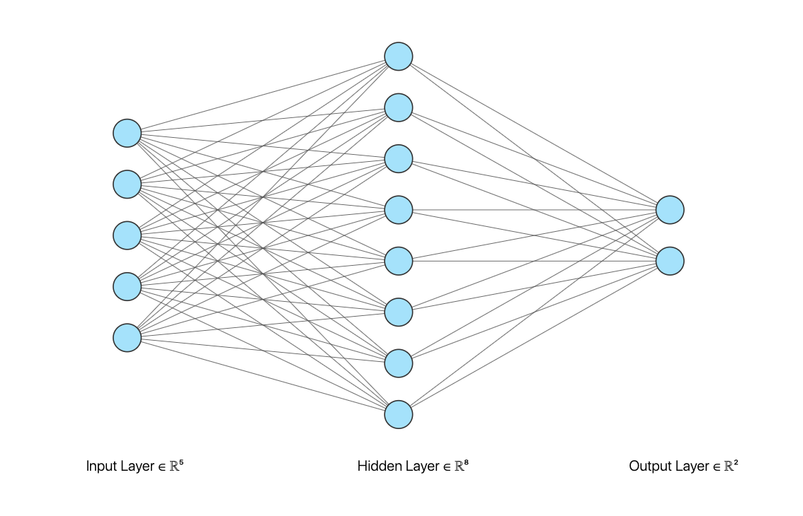

# Flappy Learn 🐣
## Neuroevolution of Flappy Bird game

[Play here](https://sahil-tah.github.io/Flappy-Learn/)

  

  Created by <a href="https://github.com/Sahil-Tah"><strong>Sahil Tah</strong></a> , <a href="https://github.com/jayu3773
    "><strong>Jayesh Shelar</strong></a> & <a href="https://github.com/TestSubject004"><strong>Tigmanshu Kumar</strong></a>

### Libraries

* **P5.js**
* **Particle.js**

### Explanation
This Project uses neural-network & genetic algorithm for bird's brain. Input of the neural network consists of Bird's y-position, Bird's y-velocity, closest distance to the pipe x-distance, upper pipe's y-dist and bottom pipe's y-distance. The output will be 2 probability scores, if the score from the desired node is greater then jump else don't.

### References
* **The Coding Train** [NN](https://github.com/CodingTrain/Toy-Neural-Network-JS)
* **Demystifying Reinforcement Learning** [Intel](https://www.intel.ai/demystifying-deep-reinforcement-learning/#gs.0lgpgr)
