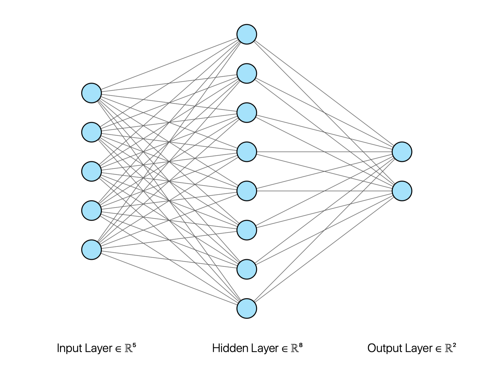

# Flappy-Learn
## Neuroevolution of Flappy Bird game

[Play here](https://sahil-tah.github.io/Flappy-Learn/)

### Libraries

* **P5.js**
* **Javascript**

### Explanation
This Project uses neural-network & genetic algorithm for bird's brain. Input of the neural network consists of Bird's y-position, closest distance to the pipe x-distance, upper pipe's y-dist and bottom pipe's y-distance. The output will be probabilty score of between 0 and 1, if greater than 0.5 jump else don't jump.

### References
* **The Coding Train** [NN](https://github.com/CodingTrain/Toy-Neural-Network-JS)
* **Demystifying Reinforcement Learning** [Intel](https://www.intel.ai/demystifying-deep-reinforcement-learning/#gs.0lgpgr)
